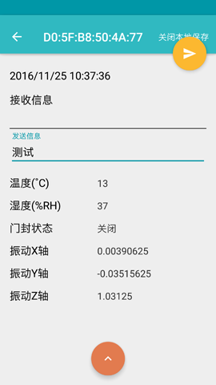

# 蓝牙监控终端
> 车载监控 Material Design

## 更新
> 2016/11/25  Version 1.1
>
> 2016/04/15  Version 1.0

## 简介
> 蓝牙监控终端，利用北斗定位导航系统的监控终端，用于采集车载的行车定位数据、温湿度、振动量、门封状态，并通过北斗短报文方式与北斗指挥机终端通信。

## 分类
> 车载监控

## 截图

### 扫描设备

### 操作设备

### 记录数据格式
<pre>
#### BleMonitorDataLog_2016-11-17_20-10-07.txt

    数据标示    |   年月日    |   时间    |    经度      |E/W |    纬度      |N/S | 温度  |  湿度  | 门封状态| 振动量X轴   |  振动量Y轴  |  振动量Z轴
--------------|------------|----------|-------------|----|-------------|----|-------|-------|-------|------------|-----------|-----------
LOCATION_TYPE | 2016/11/17 | 20:10:13 | 31.02023643 | E  | 121.2686358 | N  |  23   |  73   |  1    | -0.0390625 | -0.015625 | 0.95703125
</pre>
